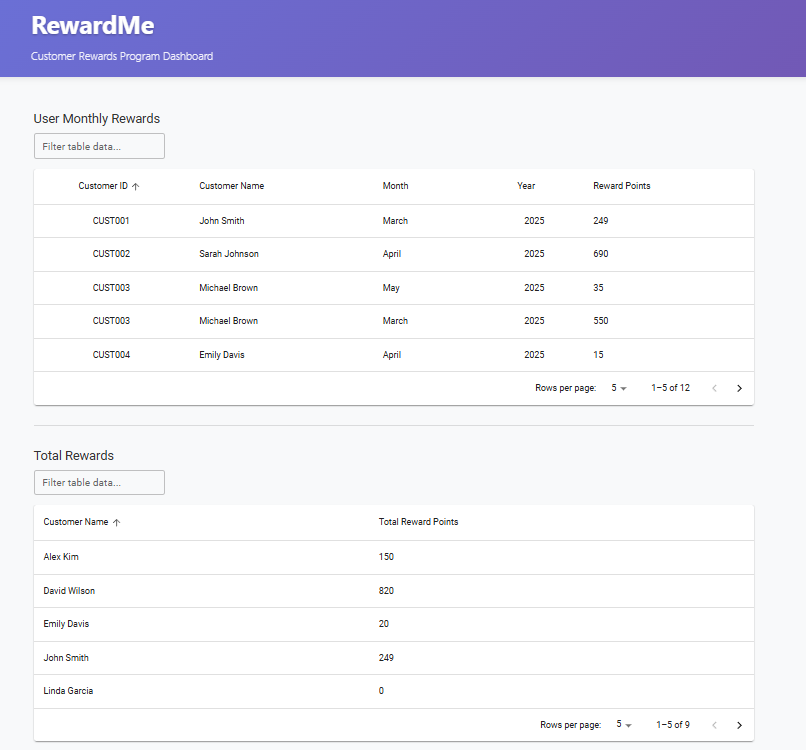

# RewardMe - Customer Rewards Program Dashboard

A comprehensive React.js application for managing and displaying customer rewards based on purchase transactions. The application calculates reward points according to specific business rules and provides an intuitive dashboard with multiple data views.

# Overview

RewardMe is a customer rewards program dashboard that helps retailers track and manage customer loyalty points. The application processes transaction data and calculates reward points based on purchase amounts, displaying the results in user-friendly tables with advanced filtering and sorting capabilities.

Actual Output :-

